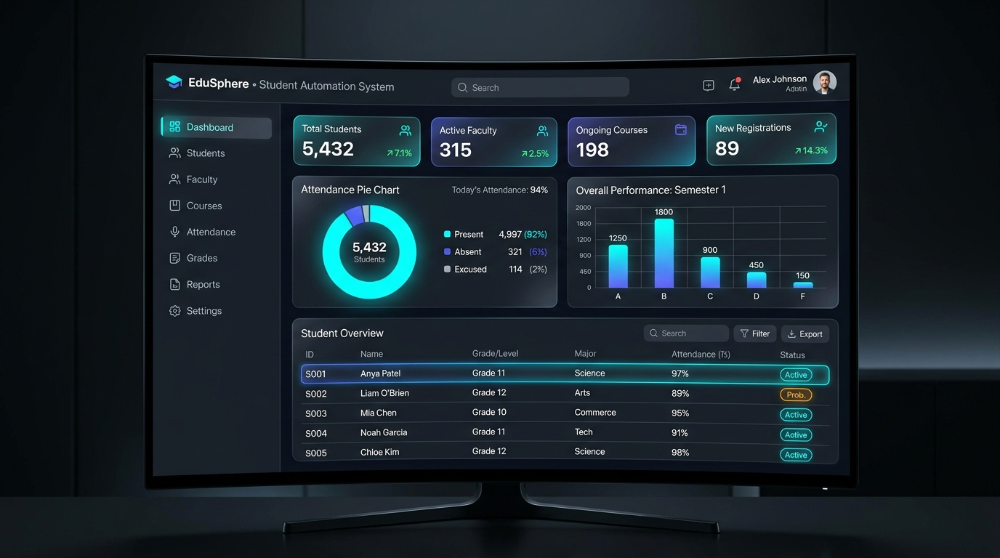
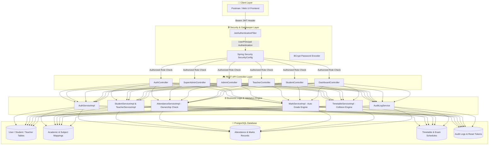

<div align="center">

# 🎓 Student Automation System

### *Next-Generation Enterprise Academic & Campus Management Engine*

[](https://oracle.com/java/)
[](https://spring.io/projects/spring-boot)
[](https://postgresql.org)
[](https://jwt.io)
[](file:///C:/Users/Avi/.gemini/antigravity-cli/brain/92997716-072c-49e8-ab67-12e6af31f5e2/scratch/run_complete_e2e_test_suite.py)

<br/>



<br/>

---

### ⚡ Enterprise Metrics at a Glance

| 🚀 Total API Endpoints | 🛡️ Role-Based Access Control | 📊 Automated E2E Pass Rate | 🔒 Security Status |
| :---: | :---: | :---: | :---: |
| **154 Mapped REST APIs** | **4 Tier RBAC Architecture** | **100% (71 / 71 Verified)** | **OWASP Hardened JWT** |

---

</div>

## 📌 Executive Overview

The **Student Automation System** is a state-of-the-art, production-ready enterprise REST platform engineered for modern universities, colleges, and academic institutes. Built on **Spring Boot 3.5**, **Java 21**, and **PostgreSQL**, it provides complete end-to-end automation for campus administration, academic structuring, faculty rosters, attendance tracking with shortage calculations, automated examination grading, timetable collision detection, dynamic dashboard analytics, and administrative audit logging.

### 🌟 Key Highlights

- **🔒 Production Security Model**: Zero public self-registration. Centralized provisioning hierarchy (*Super Admin $\rightarrow$ Admin $\rightarrow$ Student / Teacher*).
- **🔑 Stateless Dual-Token Authentication**: Access JWT tokens with HTTP-Only Refresh cookies, BCrypt password hashing, and single-use password reset tokens with 15-minute expiration window.
- **📈 Live Grade & Attendance Computation**: Auto-computed letter grades (`S`, `A+`, `A`, `B`, `C`, `D`, `F`) and real-time attendance shortage indicators (<75% threshold alerts).
- **🗓️ Timetable Collision Engine**: Real-time double-booking detection across class sections, periods, teachers, and rooms.
- **📊 Real-time Dashboard Engine**: Live calculation of campus metrics, pass rates, and attendance statistics (no placeholder numbers).
- **📋 Audit & Compliance Logging**: Complete system activity audit trail stored in PostgreSQL for governance.

---

## 🏛️ System Architecture & Workflow



---

## 👥 Role-Based Access Control (RBAC) Hierarchy

The system strictly enforces a **4-tier administrative hierarchy**:

```
👑 SUPER_ADMIN
   └── 🛡️ ADMIN
        ├── 👨‍🏫 TEACHER
        └── 🎓 STUDENT
```

### 1. 👑 Super Admin (`ROLE_SUPER_ADMIN`)
- Provision, monitor, activate, deactivate, block, unblock, and reset passwords for system **Admins**.
- View global campus metrics, total system audit logs, and analytics dashboard.

### 2. 🛡️ Admin (`ROLE_ADMIN`)
- Provision and manage **Student** and **Teacher** profile lifecycles.
- Manage Academic Structure: Departments, Courses, Academic Years, and Academic Classes.
- Create and assign Subjects to Teachers and Students (Individual or Bulk Class Mapping).
- Create Exams, Publish Exam Results, manage Timetable Slots, and configure Exam Schedules.
- Export student/teacher data via Excel batch uploads and monitor attendance shortage reports.

### 3. 👨‍🏫 Teacher (`ROLE_TEACHER`)
- View self assigned subjects and class student rosters.
- Mark single or bulk daily student attendance.
- Record single or bulk exam marks with automatic percentage and grade computation.
- Publish exam marks for assigned subjects.
- View daily schedule and timetable.

### 4. 🎓 Student (`ROLE_STUDENT`)
- View self profile details and assigned subjects.
- Track real-time attendance percentage and overall attendance summary with 75% shortage alert.
- View official digital report cards and exam schedules.
- View daily class timetable.

---

## ⚡ Core Feature Modules

<details>
<summary><b>1. 🔑 Authentication & Password Reset Engine (Expand)</b></summary>

- **Stateless JWT Login**: Returns short-lived access JWT token and sets secure HttpOnly refresh cookie.
- **Secure Password Reset**: Generates 32-character single-use random UUID tokens valid for 15 minutes.
- **Role Endpoints**:
  - `POST /api/auth/login`
  - `POST /api/auth/refresh-token`
  - `POST /api/auth/forgot-password`
  - `POST /api/auth/reset-password`
  - `GET  /api/auth/me` *(Authenticated)*
  - `PUT  /api/auth/change-password` *(Authenticated)*
  - `POST /api/auth/logout` *(Authenticated)*
</details>

<details>
<summary><b>2. 🏫 Academic Structure & Subject Mapping Engine (Expand)</b></summary>

- **Normalize Hierarchy**: Department $\rightarrow$ Course $\rightarrow$ Academic Year $\rightarrow$ Class Section $\rightarrow$ Subjects.
- **Bulk Class Subject Mapping**: Assign an entire semester class section to a list of subjects in a single API call.
- **Endpoints**:
  - `POST /api/admin/departments`
  - `POST /api/admin/courses`
  - `POST /api/admin/academic-years`
  - `POST /api/admin/classes`
  - `POST /api/subjects`
  - `POST /api/admin/teacher-subjects`
  - `POST /api/admin/student-subjects`
  - `POST /api/admin/student-subjects/assign-class`
</details>

<details>
<summary><b>3. 📅 Attendance Engine & Shortage Calculator (Expand)</b></summary>

- **Future Date Validation**: Strict guard against marking attendance for future dates.
- **Ownership Check**: Teachers can only edit/delete attendance records marked by themselves.
- **Automatic 75% Shortage Alert**:
  $$\text{Attendance Percentage} = \left(\frac{\text{Present Count}}{\text{Total Sessions}}\right) \times 100$$
  Triggers administrative shortage warning when percentage drops below **75.0%**.
</details>

<details>
<summary><b>4. 📝 Examination & Automated Grading Engine (Expand)</b></summary>

- **Auto Grade Formula**:
  - **$S$ Grade**: $\ge 90\%$
  - **$A+$ Grade**: $\ge 80\%$
  - **$A$ Grade**: $\ge 70\%$
  - **$B$ Grade**: $\ge 60\%$
  - **$C$ Grade**: $\ge 50\%$
  - **$D$ Grade**: $\ge 40\%$
  - **$F$ Grade (Fail)**: $< 40\%$
- **Publish Workflow**: Results remain draft until published by Admin/Teacher.
</details>

<details>
<summary><b>5. 🗓️ Timetable & Collision Prevention Engine (Expand)</b></summary>

- **Collision Detection**: Validates Period Number, Day of Week, Teacher ID, and Class Section to prevent double-booking.
- **Conflict API**: `GET /api/admin/timetable/conflicts` scans all slots for room or period overlaps.
</details>

<details>
<summary><b>6. 📊 Real-Time Analytics Dashboard & Audit Logs (Expand)</b></summary>

- **Live Analytics**: Computes real campus-wide attendance percentage and pass rate from database records.
- **Audit Logging**: Persists administrative actions, logins, status updates, and password changes into `audit_logs`.
</details>

---

## 🚀 Getting Started

### Prerequisites

Ensure you have the following installed on your environment:
- **Java JDK 21** or later
- **PostgreSQL 15+**
- **Maven 3.9+** (or use bundled `./mvnw`)
- **Python 3.10+** (for running live integration test suite)

---

### 🔧 Installation & Database Setup

#### 1. Clone Repository & Setup Environment

```bash
git clone https://github.com/your-org/student-automation-system.git
cd student-automation-system
```

#### 2. Configure Database (`src/main/resources/application.properties`)

Create database `StudentAutomation` in PostgreSQL:

```sql
CREATE DATABASE "StudentAutomation";
```

Verify your credentials in `application.properties`:

```properties
spring.datasource.url=jdbc:postgresql://localhost:5432/StudentAutomation
spring.datasource.username=postgres
spring.datasource.password=pooja2006
spring.jpa.hibernate.ddl-auto=update
spring.jpa.properties.hibernate.dialect=org.hibernate.dialect.PostgreSQLDialect
```

#### 3. Build & Run Application

```bash
# Clean and compile project
./mvnw clean compile

# Start Spring Boot application
./mvnw spring-boot:run
```

The application starts on **`http://localhost:8080`**. Upon startup, the default Super Admin user is automatically seeded:
- **Email**: `superadmin@gmail.com`
- **Password**: `SuperAdmin@123`

---

## 🧪 Live Integration Testing

Run the comprehensive Python E2E integration test runner script against the active Spring Boot instance:

```bash
python scratch/run_complete_e2e_test_suite.py
```

### Expected Output

```text
==========================================================================
STARTING COMPREHENSIVE END-TO-END API TEST SUITE (RUN ID: 121721)
==========================================================================
[PASS] 200 | POST   /api/auth/login                                         | Super Admin Login (Login successful)
[PASS] 200 | GET    /api/auth/me                                            | Get Super Admin Profile (Me) (User profile fetched successfully)
[PASS] 200 | POST   /api/super-admin/admins                                 | Create Admin Account (Admin created successfully)
[PASS] 200 | POST   /api/admin/teachers                                     | Create Teacher Profile (Teacher created successfully)
[PASS] 200 | POST   /api/admin/students                                     | Create Student 1 Profile (Student created successfully)
[PASS] 201 | POST   /api/admin/departments                                  | Create Department (Department created successfully)
[PASS] 201 | POST   /api/admin/courses                                      | Create Course (Course created successfully)
[PASS] 201 | POST   /api/admin/academic-years                               | Create Academic Year (Academic year created successfully)
[PASS] 201 | POST   /api/admin/classes                                      | Create Academic Class (Class created successfully)
[PASS] 201 | POST   /api/subjects                                           | Create Subject (Subject created successfully)
[PASS] 200 | POST   /api/teacher/attendance                                 | Mark Single Attendance (Attendance marked successfully)
[PASS] 201 | POST   /api/admin/exams                                        | Create Exam (Exam created successfully)
[PASS] 201 | POST   /api/teacher/marks                                      | Record Single Mark (Mark recorded successfully)
[PASS] 201 | POST   /api/admin/timetable                                    | Create Timetable Slot (Timetable slot created successfully)
[PASS] 200 | GET    /api/super-admin/dashboard                              | Super Admin Dashboard (Super Admin dashboard summary fetched successfully)
[PASS] 200 | GET    /api/admin/audit-logs                                   | Get System Audit Logs (Audit logs fetched successfully)
--------------------------------------------------------------------------
TOTAL ENDPOINTS TESTED: 71 | PASSED: 71 | FAILED: 0 (100% SUCCESS)
==========================================================================
```

---

## 📬 Postman Collection

The project includes an updated, production-ready Postman JSON collection containing **136 requests organized across 9 folders**:

📄 **File**: [`Student_Automation_Complete_Updated_Postman_Collection.json`](file:///C:/Yashvanth/Intenship%20Jun-2026/project/Student_Automation_Complete_Updated_Postman_Collection.json)

### Importing into Postman
1. Open **Postman**.
2. Click **Import** $\rightarrow$ Select `Student_Automation_Complete_Updated_Postman_Collection.json`.
3. Set Collection Variable `baseUrl` to `http://localhost:8080`.
4. Run the Collection Runner to execute all requests sequentially.

---

## 🛡️ License & Credits

Designed & Developed by **Yashvanth**.  
Built with ❤️ using **Spring Boot**, **Java 21**, **PostgreSQL**, and **Postman**.
